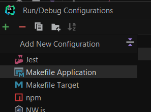

# Introduction aux outils JetBrains

Workshop d'introduction à la suite d'outils JetBrains

### Ce workshop concerne principalement CLion et Pycharm, qui vous seront utiles lors des projets Epitech.

Clion est utilisé pour du développement C/C++, Pycharm est orienté vers du développement Python.

#

## 1 - Récupération des clés de produit

Vous disposez de deux façons différentes d'obtenir gratuitement une licence pour les produits JetBrains.

### 1.1 - GitHub Student Pack

En passant par le Student Pack de GitHub vous pouvez obtenir des bundles contenant des logiciels utiles pour le développement, ainsi qu'une upgrade gratuite vers GitHub Pro pour votre compte.

Vous pouvez donc vous enregistrer [ici](https://education.github.com/pack) pour pouvoir vous connecter et suivre la procédure pour bénéficier du Student Pack

### 1.2 - Console.bocal

Epitech met à la disposition de ses étudiants des licences gratuites pour des logiciels utiles à ses étudiants. Vous avez juste besoin de vous connecter avec votre compte Microsoft 365 à [console.bocal.org](console.bocal.org)

## 2 - Création du (ou connexion au) compte [JetBrains](https://www.jetbrains.com/)

Une fois que vous avez récupéré votre clé de produit, vous pouvez vous connecter à [JetBrains](https://www.jetbrains.com/).

Une fois connecté, vous pouvez enregistrer votre clé de produit sur [la page de votre compte](https://account.jetbrains.com/licenses).

L'enregistrement de votre clé de produit nécessitera sûrement une vérification de votre addresse e-mail.

## 3 - Téléchargement des produits

Ce workshop est orienté autour de CLion et Pycharm, mais vous pouvez télécharger tous les produits qui vous intéressent.

Une fois les installeurs téléchargés et exécutés, une connexion à votre compte ou le renseignement de vos clés de produit sera nécéssaire.

#

## Prise en main

Nous allons créer un projet en C++ sur CLion afin de réaliser des tests divers et variés.

Pour celles et ceux ayant suivi mon workshop sur la mise en place d'un environnement Windows 11 / WSL, vous pouvez constater juste ici qu'il est possible de créer et utiliser des projets directement sur la partie Linux de votre système.

Une fois le projet crée, l'interface ne devrait pas dépayser ceux ayant déjà travaillé sur un IDE professionnel (e.g. Microsoft Visual Studio).

L'onglet de navigation du projet se trouve sur la gauche, le terminal est accessible en bas à gauche, la séléction des configurations de lancement est disponible en haut à droite.

Les projets sur CLion sont basés autour de l'utilisation du système CMake, nous pouvons constater que celui-ci est crée automatiquement en même temps que le projet. Il est également possible d'utiliser un Makefile, le changement est possible dans l'éditeur de configurations :

La sélection 'Makefile Application' est séléctionnable en descendant un peu dans le menu déroulant.

Toutes les options de configuration sont disponibles dans le menu 'Run/Debug Configurations'. Vous pouvez y ajouter des configurations personnalisées, par exemple pour lancer votre programme avec des arguments, des variables d'environnement spécifiques ou encore un dossier de lancement autre que celui par défaut.

## Linting

Le linting est une fonctionnalité qui permet de vérifier la qualité du code source. Elle permet de détecter des erreurs de syntaxe, des erreurs de logique, des erreurs de style, etc.

CLion propose un linting intégré basé sur le linter Clang-Tidy. L'option s'active par défaut dès la création d'un fichier `.clang-tidy` à la racine du projet.

Cet icône  en bas à droite de l'éditeur indique que le linting est activé.

Cette fonctionnalité vous permettra de détecter et d'afficher en direct les éventuelles erreurs logiques ou de syntaxe dans votre code.

## Debugging

CLion propose un débogueur intégré, qui permet de débugger votre programme en mode pas à pas, de mettre des points d'arrêts, de visualiser les variables, etc.

Il intègre également Valgrind pour détecter les fuites de mémoire, les accès non initialisés, etc.

Tous ces modes de lancement sont accessibles en haut à droite de l'interface, à côté des configurations de lancement que nous avons vues tout à l'heure.

Le lancement de votre programme en mode debug permettra de tenir compte des points d'arrêts que vous aurez placés dans votre code.

> **Note :** Attention, si vous ne lancez pas votre programme en mode debug, les points d'arrêts ne seront pas pris en compte.

La mise en place d'un point d'arrêt permet de stopper l'exécution de votre programme à un endroit précis, afin de pouvoir visualiser les variables, les appels de fonctions, etc.
Depuis la fenêtre de débogage, il vous sera possible de faire avancer votre programme pas à pas, de rentrer dans les fonctions appelées et de réaliser tout un tas d'autres actions.